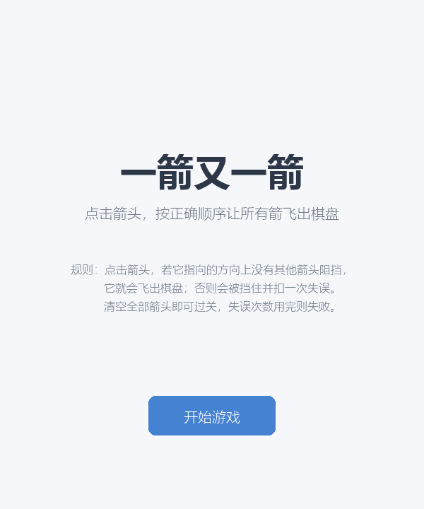
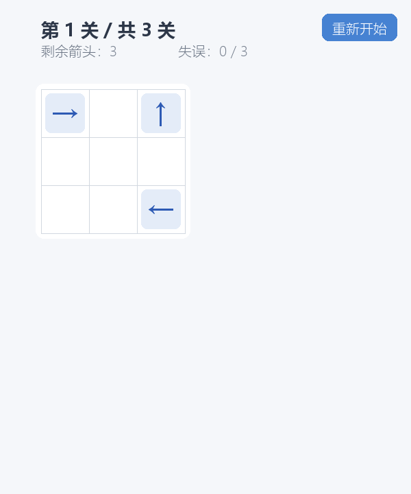
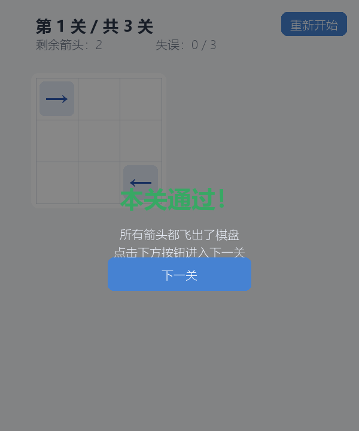
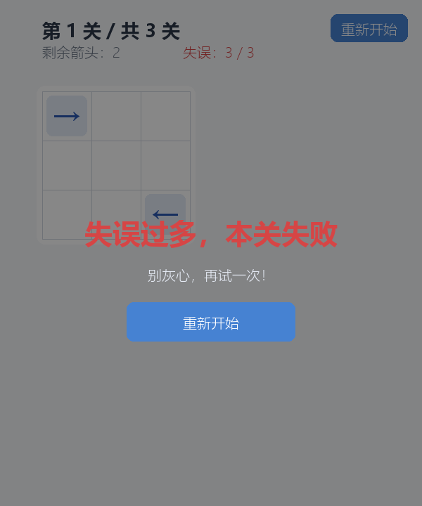

# 一箭又一箭（Arrow Out）

> 2026 秋 福州大学 软件工程 个人作业（第二次）—— 用 Python + AIGC 完成的点击式箭头解谜小游戏。

## 一、游戏简介

"一箭又一箭"是一款点击式箭头解谜游戏。棋盘中分布着若干个带方向（↑↓←→）的箭头，玩家需要观察箭头的方向和相互阻挡关系，按照正确的顺序点击箭头，让所有箭头依次飞出棋盘边界。

- **核心规则**：点击一个箭头后，程序沿它指向的方向扫描到棋盘边界；若途中没有其他箭头阻挡，它就飞出棋盘；否则被挡住，记一次失误。
- **目标**：用最少的失误清空当前棋盘上的所有箭头，进入下一关。
- **失败条件**：失误次数（每关 3 次）耗尽则本关失败，可重新开始。

## 二、开发环境

| 项目 | 说明 |
|---|---|
| 操作系统 | Windows 10 / 11（macOS、Linux 亦可运行） |
| Python | 3.10 及以上（开发环境为 Python 3.14） |
| 图形库 | pygame-ce 2.5.x（pygame 社区维护版） |
| 代码编辑器 | VS Code / Trae（AIGC 辅助） |

## 三、安装与运行

```bash
# 1. 进入项目目录
cd arrow_game

# 2. （建议）创建并激活虚拟环境后，安装依赖
pip install -r requirements.txt

# 3. 运行游戏
python main.py
```

> 说明：本项目使用 `pygame-ce` 而非原版 `pygame`，因为它对新版 Python 支持更好、安装更顺畅。若你已装原版 pygame 也可直接运行。

## 四、游戏操作说明

| 操作 | 效果 |
|---|---|
| 鼠标左键点击箭头 | 若前方无阻挡，箭头飞出棋盘并消失；若被阻挡，箭头变红抖动，失误次数 -1 |
| 右上角"重新开始"按钮 | 重置当前关卡的箭头布局与失误次数 |
| "开始游戏"按钮 | 从开始界面进入第一关 |
| "下一关"按钮 | 本关清空后进入下一关 |
| 通关失败后的"重新开始" | 重新挑战当前关卡 |

界面上会实时显示：**当前关卡 / 总关数、剩余箭头数量、剩余失误次数**。

## 五、关卡设计

共设计 3 个难度递进的关卡，每个关卡都已通过自动化脚本验证存在合法通关顺序：

- **第 1 关（3×3，教学关）**：3 个箭头，理解"谁先飞"。
- **第 2 关（4×4）**：4 个箭头，形成环形阻挡链。
- **第 3 关（5×5）**：5 个箭头，需要按依赖顺序逐个消除。

## 六、项目结构

```
arrow_game/
├── main.py           # Pygame 图形界面主程序（状态机 + 动画）
├── core.py           # 纯逻辑层：方向定义、路径检测、关卡数据（不依赖 pygame）
├── test_core.py      # 自动化测试（T01~T06，可独立运行）
├── requirements.txt  # 依赖清单
├── README.md         # 本文件
└── shot_*.png        # 游戏截图（开始/游戏/通关/失败界面）
```

将**逻辑层（core.py）与界面层（main.py）分离**是本项目的关键设计：路径判断等核心算法不依赖任何图形库，因此可以用 `python test_core.py` 在无图形环境下直接跑单元测试。

## 七、游戏截图

### 开始界面


### 游戏进行中


### 通关界面


### 失败界面


## 八、测试

```bash
python test_core.py
```

覆盖作业要求的 T01~T06 六个测试点，并额外校验三个关卡均可解。
